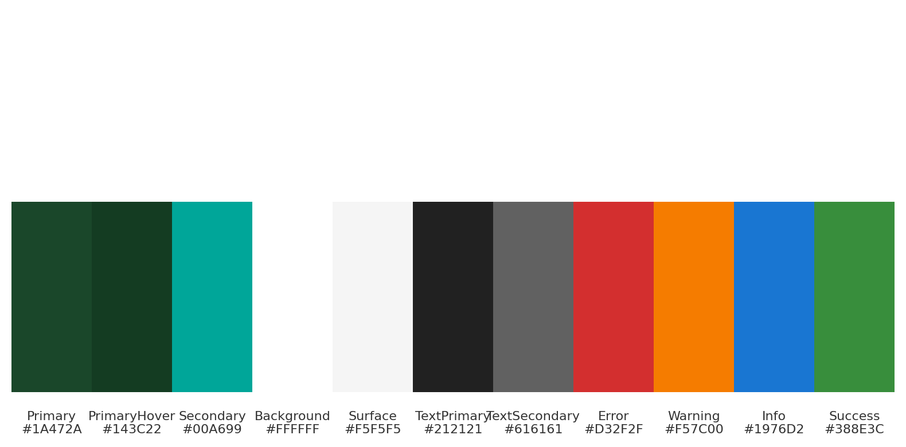

# デザイントークン定義

デザイントークンとは、UI開発で再利用可能なデザイン要素（カラー、タイポグラフィ、スペーシングなど）を体系的に管理するための定数です。以下では、本アプリで使用する基本的なデザイントークンを定義します。

---
## 1. カラーパレット



```jsonc
{
  "color": {
    "primary": "#1A472A",        // メインアクション（ウィンブルドン風グリーン）,        // メインアクション（ボタン等）
    "primaryHover": "#143C22",        // ホバー時のウィンブルドン風ダークグリーン
    "secondary": "#00A699",      // 補助手段（リンク等）
    "background": "#FFFFFF",     // 背景色
    "surface": "#F5F5F5",        // カード等の背景
    "textPrimary": "#212121",    // メインテキスト
    "textSecondary": "#616161",  // 補助テキスト
    "error": "#D32F2F",          // エラーメッセージ
    "warning": "#F57C00",        // 警告
    "info": "#1976D2",           // 情報
    "success": "#388E3C"         // 成功
  }
}
```

## 2. タイポグラフィ
```jsonc
{
  "fontSize": {
    "xs": "12px",
    "sm": "14px",
    "base": "16px",
    "lg": "20px",
    "xl": "24px",
    "2xl": "32px"
  },
  "fontWeight": {
    "regular": 400,
    "medium": 500,
    "bold": 700
  },
  "lineHeight": {
    "base": 1.5,
    "heading": 1.2
  }
}
```

## 3. スペーシング（間隔スケール）
```jsonc
{
  "spacing": {
    "xs": "4px",
    "sm": "8px",
    "md": "16px",
    "lg": "24px",
    "xl": "32px"
  }
}
```

## 4. ボーダー・形状
```jsonc
{
  "radius": {
    "sm": "4px",
    "md": "8px",
    "lg": "16px"
  },
  "borderWidth": {
    "default": "1px",
    "thick": "2px"
  }
}
```

## 5. シャドウ
```jsonc
{
  "shadow": {
    "sm": "0 1px 2px rgba(0, 0, 0, 0.05)",
    "md": "0 4px 6px rgba(0, 0, 0, 0.1)",
    "lg": "0 10px 15px rgba(0, 0, 0, 0.15)"
  }
}
```

---
これらのトークンを `theme.json` や Tailwind の `theme.extend` に移植し、コンポーネント設計時に活用してください。

