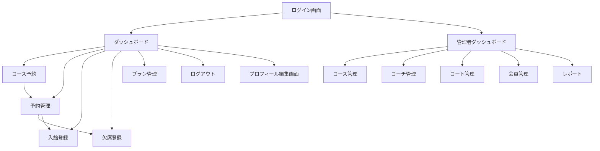

# 画面遷移図とワイヤーフレーム

## 1. 画面遷移図



## 2. ワイヤーフレーム

### 2.1 ログイン画面
```
+------------------------+
|        テニス 予約管理       |
+------------------------+
| ユーザー名 [__________]   |
| パスワード [__________]   |
| [ ログイン ] [パスワード再発行] |
+------------------------+
```

### 2.2 ダッシュボード画面（会員用）
```
+------------------------------------------------+
| ダッシュボード                                  |
+------------------------------------------------+
| [入館登録]                                     |
| 残予約枠：2 [コース予約]                        |
| 今週のレッスン一覧                             |
|  - 4/1 18:00 初級 (コーチA, コート1) [欠席登録] |
|  - 4/3 20:00 中級 (コーチB, コート2) [欠席登録] |
+------------------------------------------------+
| [予約管理] [プラン管理]                         |
+------------------------------------------------+
```

### 2.3 コース予約画面
```
+------------------------------------------------+
| コース予約                                    |
+------------------------------------------------+
| レベル: [ 初級 ▼ ]  日付: [ 4/ ] ▼  時間: [ ▼ ]|
| +----------------------------+               |
| | カレンダー表示 (空き日を色付)         |               |
| +----------------------------+               |
| [ 検索 ]                                    |
| 検索結果                                     |
|  - 4/8 18:00 初級 (コーチA, コート1) [予約] |
+------------------------------------------------+
```

### 2.4 管理者ダッシュボード画面
```
+------------------------------------------------+
| 管理者ダッシュボード                           |
+------------------------------------------------+
| 次回レッスン出席状況                           |
| レッスン: 4/1 18:00 初級 (コーチA, コート1)      |
|  - 参加予定: 8人   欠席登録: 2人               |
+------------------------------------------------+
| [コース管理] [コーチ管理] [コート管理]        |
| [会員管理] [レポート]                          |
+------------------------------------------------+
```

